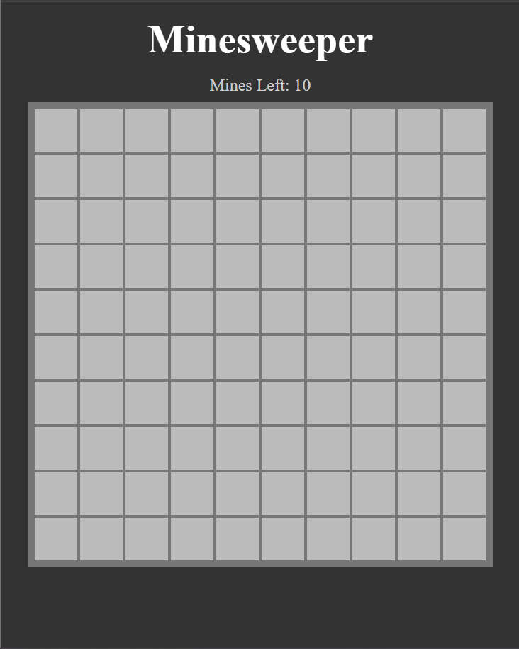
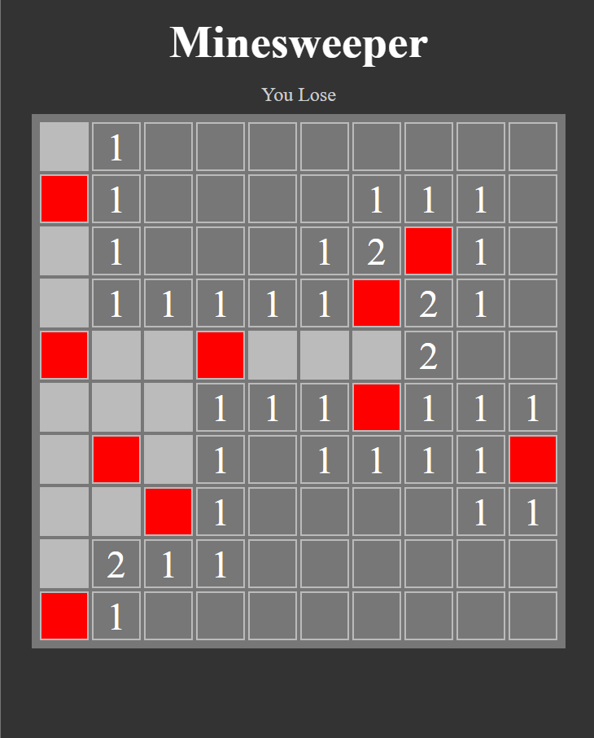

# Minesweeper

A web-based implementation of the classic Minesweeper game. Test your logic and problem-solving skills by uncovering tiles while avoiding hidden mines!

## Features

- **Dynamic Board Generation**: Customizable board size and number of mines.
- **Interactive Gameplay**: Left-click to reveal tiles, right-click to flag potential mines.
- **Win/Lose Conditions**: Automatically detects when the game is won or lost.
- **Responsive Design**: Optimized for various screen sizes.

## Screenshots

### Game Start


### Game in Progress


## Getting Started

Follow these instructions to set up and run the project locally.

### Prerequisites

- [Node.js](https://nodejs.org/) (version 16 or higher)
- [npm](https://www.npmjs.com/) or [yarn](https://yarnpkg.com/)

### Installation

1. Clone the repository:
   ```bash
   git clone https://github.com/your-username/minesweeper.git
   cd minesweeper
   ```

2. Install dependencies:
   ```bash
   npm install
   ```

3. Start the development server:
   ```bash
   npm run dev
   ```

4. Open your browser and navigate to `http://localhost:5173`.

### Build for Production

To create a production build, run:
```bash
npm run build
```

The build files will be available in the `dist` directory.

## How to Play

1. **Objective**: Uncover all tiles without triggering a mine.
2. **Controls**:
   - Left-click: Reveal a tile.
   - Right-click: Flag a tile as a potential mine.
3. **Winning**: Reveal all non-mine tiles.
4. **Losing**: Reveal a tile containing a mine.

## Project Structure

```
minesweeper/
├── src/
│   ├── main.js       # Main game logic
│   ├── logic.js      # Game mechanics and helper functions
│   └── style.css     # Styling for the game
├── index.html        # Entry point
├── package.json      # Project metadata and dependencies
└── .gitignore        # Ignored files and directories
```

## Contributing

Contributions are welcome! Feel free to open issues or submit pull requests to improve the project.

## License

This project is licensed under the [MIT License](./LICENSE).

## Acknowledgments

- Inspired by the classic Minesweeper game.
- Built using [Vite](https://vitejs.dev/) for fast development.

